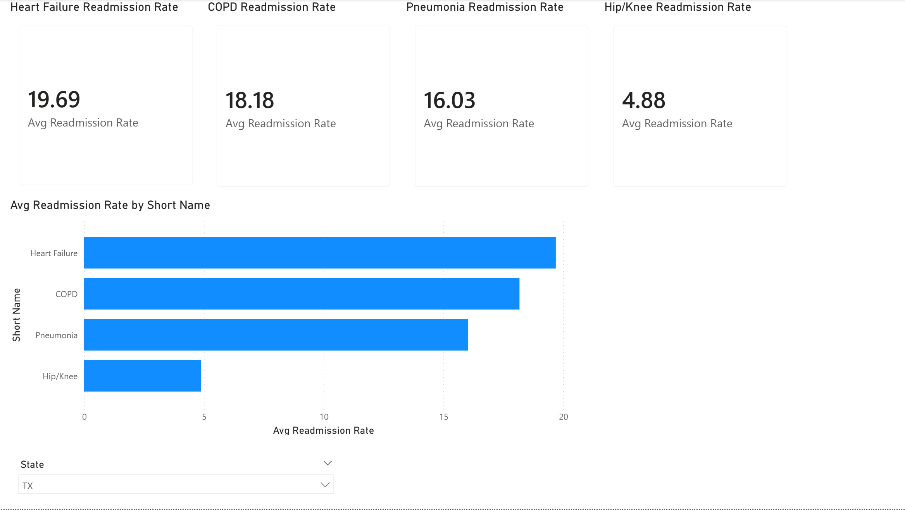
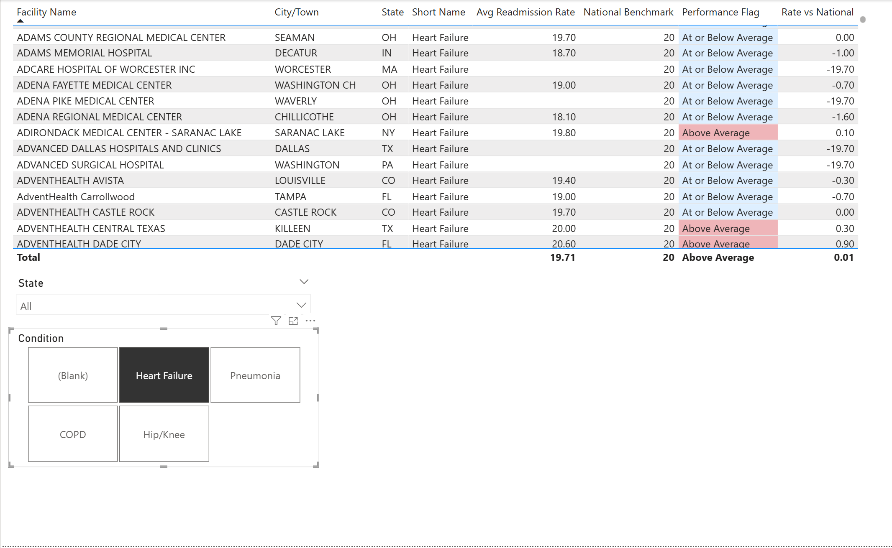

# Hospital Readmissions Quality Dashboard
**Tool:** Power BI Desktop  
**Data Source:** CMS Hospital Compare — Unplanned Hospital Visits  
**Dataset:** ~19,000 facility-level records across 4,000+ Medicare-certified hospitals  
**Built:** April 2026

---

## Overview

This dashboard analyzes 30-day unplanned readmission rates for four CMS-tracked 
conditions — Heart Failure, COPD, Pneumonia, and Hip/Knee Replacement — across 
Medicare-certified hospitals nationwide. It mirrors the quality metrics used in 
value-based care programs like the Hospital Readmissions Reduction Program (HRRP).

---

## Dashboard Pages

### Page 1 — Executive Overview

- KPI cards showing national average readmission rates for all 4 conditions
- Horizontal bar chart comparing readmission rates by condition
- State slicer enabling regional filtering across all visuals

### Page 2 — Facility Drill-Down

- Hospital-level table with conditional formatting flagging above-average performers
- Rate vs. National column showing each facility's variance from the CMS benchmark
- Slicers for State and Condition enabling operational-level filtering

---

## Data Model

Star schema with one fact table and three dimension tables:
FactReadmissions (Unplanned_Hospital_Visits-Hospital)

├── DimFacility (Hospital_General_Information) — on Facility ID

└── DimCondition (manual lookup table) — on Measure ID
**Measures filtered to:** READM_30_HF, READM_30_COPD, READM_30_PN, READM_30_HIP_KNEE

---

## DAX Measures

| Measure | Purpose |
|---|---|
| `Avg Readmission Rate` | AVERAGE of facility Score column |
| `National Benchmark` | SWITCH-based CMS published benchmarks by condition |
| `Rate vs National` | Facility rate minus national benchmark |
| `Performance Flag` | "Above Average" or "At or Below Average" |

**Centerpiece metric:** `Rate vs National` — drives conditional formatting 
and identifies facilities with excess readmissions relative to CMS benchmarks.

---

## Key Insights

- **Heart Failure** has the highest readmission rate nationally (~19.7%), 
  nearly 4x the Hip/Knee rate — reflecting the complexity of managing 
  decompensated CHF post-discharge
- **COPD** closely follows (~18.2%), driven by exacerbation risk in the 
  30-day post-discharge window
- **Hip/Knee Replacement** has the lowest rate (~4.8%), consistent with 
  CMS data showing improvement since HRRP penalties were introduced in 2012
- State-level filtering reveals meaningful regional variation — facilities 
  in certain states cluster above the national benchmark, suggesting 
  systemic care coordination gaps rather than individual facility failures
- The `Rate vs National` metric surfaces which specific facility-condition 
  combinations are driving excess readmissions, enabling targeted quality 
  improvement intervention

---

## Technical Notes

- Score column cleaned in Power Query (replaced "Not Available" with null, 
  cast to Decimal)
- National benchmarks sourced from CMS published rates and implemented as 
  SWITCH constants for reliability
- 665 rows excluded due to insufficient case volume (CMS suppression policy)
- Data reflects CMS performance period: July 2021 – June 2024

---

## Reflection

Building this dashboard reinforced several things about healthcare BI work:

**On the data:** CMS suppresses rates for facilities with too few cases — 
those 665 nulls aren't noise, they're a deliberate policy decision to avoid 
publishing unreliable statistics. Understanding *why* data is missing is as 
important as handling it technically.

**On the model:** The SWITCH-based benchmark approach is more robust than 
joining to the national file when that file has mixed text/numeric columns. 
In production I'd solve this upstream in Power Query, but for a rapid 
prototype the constants are defensible and transparent.

**On the metric:** `Rate vs National` is intentionally simple — a single 
number that tells an operational leader exactly how far above or below 
average a facility is. Healthcare audiences don't need statistical 
complexity; they need actionable signals.
